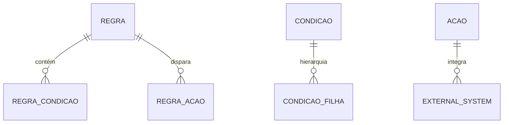

# \# Prompt:

Desenvolva uma modelagem de dados para a criação de um "Motor de Regras", atendendo às seguintes especificações:

1. Proposta da Solução
    * Descreva o objetivo do motor de regras e seus principais componentes.
    * Explique como as condições lógicas (AND, OR, XOR, NOT) serão modeladas e avaliadas.
    * Detalhe como a flexibilidade e expansibilidade do motor poderão ser mantidas.
    * Especifique possíveis integrações com sistemas externos (caso aplicável).
2. Documentação Básica
    * Definição das entidades principais (como Regra, Condição, Grupo de Regras, Ação).
    * Relacionamentos entre entidades.
    * Fluxo básico de execução da avaliação das regras.
    * Exemplo de cadastro de uma regra composta por múltiplas condições lógicas (AND, OR, XOR).
    * Explicação das opções para customização de operadores lógicos.
3. DDL das Tabelas Necessárias
    * Defina o script SQL (DDL) para criação das tabelas essenciais, incluindo as colunas, tipos de dados, chaves primárias e estrangeiras.
    * Implemente tabelas que representem:
3.1. Regras (identificação, status, descrição)
3.2. Condições (tipo, valor de comparação, operador lógico)
3.3. Relacionamento entre regras e condições
3.4. Ações disparadas pelo motor
    * Inclua exemplos de inserção de dados (opcional).
4. Requisitos Adicionais
    * Estruture a modelagem para suportar aninhamento/multinível de condições e regras.
    * Garanta normalização suficiente para flexibilidade e performance.
    * Considere cenários de versionamento ou histórico de regras.

Entregue a modelagem com os tópicos acima, utilizando linguagem clara e objetiva, mantendo a padronização de nomenclatura e boas práticas de modelagem relacional

A modelagem proposta para o Motor de Regras segue princípios de normalização relacional e flexibilidade arquitetural, integrando conceitos de programação orientada a objetos e lógica booleana:

## 1. Proposta da Solução

**Objetivo**: Automatizar a avaliação de condições complexas usando operadores lógicos combináveis, com capacidade de acionar ações em sistemas integrados. Principais componentes:

- **Regra**: Unidade básica de decisão com condições associadas
- **Condição**: Expressão lógica avaliável
- **Ação**: Operação executada quando regras são atendidas
- **Motor de Avaliação**: Processador de regras com interpretação lógica

**Condições lógicas**: Modeladas através de operadores armazenados em tabela de domínio (`AND`, `OR`, `XOR`, `NOT`), permitindo combinações via estrutura hierárquica de condições[^3].

**Flexibilidade**: Arquitetura baseada em componentes com:

- Tabelas de parâmetros configuráveis
- Polimorfismo através de tipos de condições
- Versionamento de regras[^4]

**Integrações**: Possibilidade de acionar serviços externos via tabela `external_system` com detalhes de conexão[^2].

## 2. Documentação Básica

**Entidades Principais**:

- **Regra**: Armazena definição e status (id, nome, status, versão)
- **Condição**: Expressões lógicas individuais (tipo, operador, valor)
- **GrupoRegra**: Agrupamento de regras para avaliação sequencial
- **Ação**: Operações executáveis (HTTP, mensageria, banco de dados)

**Relacionamentos**:



**Fluxo de Execução**:

1. Seleciona regras ativas
2. Resolve hierarquia de condições
3. Avalia expressão lógica composta
4. Dispara ações vinculadas

**Exemplo de Regra Composta**:

```sql
-- Regra: Aprovação de crédito
INSERT INTO condicao (id, tipo, operador, valor, parent_id) VALUES
(1, 'NUMERICO', '&gt;', '5000', NULL),       -- Renda &gt; 5000 (OR)
(2, 'BOOLEANO', '==', 'true', 1),        -- OR: Histórico positivo
(3, 'NUMERICO', '&lt;', '0.3', 1);          -- OR: Endividamento &lt; 30%
```


## 3. DDL das Tabelas

```sql
CREATE TABLE regra (
    id SERIAL PRIMARY KEY,
    nome VARCHAR(100) NOT NULL,
    descricao TEXT,
    status VARCHAR(20) DEFAULT 'RASCUNHO',
    versao INTEGER DEFAULT 1,
    created_at TIMESTAMP DEFAULT CURRENT_TIMESTAMP
);

CREATE TABLE condicao (
    id SERIAL PRIMARY KEY,
    tipo VARCHAR(20) NOT NULL CHECK (tipo IN ('NUMERICO', 'TEXTO', 'BOOLEANO', 'DATA')),
    operador VARCHAR(10) NOT NULL CHECK (operador IN ('AND','OR','XOR','NOT','==','!=','&gt;','&lt;','&gt;=','&lt;=')),
    valor VARCHAR(255),
    parent_id INTEGER REFERENCES condicao(id),
    regra_id INTEGER REFERENCES regra(id)
);

CREATE TABLE acao (
    id SERIAL PRIMARY KEY,
    tipo VARCHAR(20) NOT NULL CHECK (tipo IN ('HTTP','MENSAGERIA','BANCO_DADOS')),
    parametros JSONB,
    sistema_id INTEGER REFERENCES external_system(id)
);

CREATE TABLE regra_acao (
    regra_id INTEGER REFERENCES regra(id),
    acao_id INTEGER REFERENCES acao(id),
    ordem_execucao INTEGER,
    PRIMARY KEY (regra_id, acao_id)
);

CREATE TABLE external_system (
    id SERIAL PRIMARY KEY,
    nome VARCHAR(50) NOT NULL,
    tipo_conexao VARCHAR(20),
    endpoint VARCHAR(255)
);
```


## 4. Requisitos Adicionais

**Estrutura de Aninhamento**:

- Campo `parent_id` na tabela `condicao` permite construção de árvores lógicas
- Avaliação recursiva via CTE (Common Table Expressions)

**Otimizações**:

- Índices em colunas de relacionamento (regra_id, parent_id)
- Particionamento por versão de regra
- Cache de avaliação para condições estáticas

**Versionamento**:

```sql
CREATE TABLE regra_historico (
    id SERIAL PRIMARY KEY,
    regra_id INTEGER NOT NULL,
    versao INTEGER NOT NULL,
    snapshot JSONB NOT NULL,
    altered_at TIMESTAMP DEFAULT CURRENT_TIMESTAMP
);
```

**Exemplo de Inserção**:

```sql
-- Regra: Notificar cliente especial
INSERT INTO regra (nome, descricao, status) VALUES 
('CLIENTE_ESPECIAL', 'Clientes com compras acima de R$10k ou taxa especial', 'ATIVO');

INSERT INTO condicao (tipo, operador, valor, regra_id) VALUES
('NUMERICO', '&gt;', '10000', 1),  -- Compra &gt; 10000
('BOOLEANO', '==', 'true', 1);  -- OR Taxa especial
```

Esta modelagem permite a criação de regras complexas com múltiplos níveis de condições lógicas, mantendo desempenho através de normalização adequada e flexibilidade para expansão futura[^1][^4].

<div style="text-align: center">⁂</div>

[^1]: https://bdtd.ufcg.edu.br/jspui/bitstream/riufcg/38622/1/BRUNO NASCIMENTO GOMES DE OLIVEIRA-MONOGRAFIA-CEEI-BACHARELADO EM ENGENHARIA ELÉTRICA (2024).pdf

[^2]: https://www.youtube.com/watch?v=zHvRvozq8mk

[^3]: https://www.makerhero.com/blog/o-que-sao-portas-logicas/

[^4]: https://pergamum.ufpel.edu.br/pergamumweb/vinculos/000105/00010528.pdf

[^5]: https://raquelsilveira.files.wordpress.com/2010/09/aula2e3.pdf

[^6]: https://www.youtube.com/watch?v=2-Y1oqRfIGU

[^7]: https://learn.microsoft.com/pt-br/sql/t-sql/statements/create-rule-transact-sql?view=sql-server-ver16

[^8]: https://proedu.rnp.br/bitstream/handle/123456789/354/Sistemas_de_Gerenciamento_de_Banco_de_Dados_CAPA_ficha_20130308.pdf?sequence=1\&isAllowed=y

[^9]: https://qitech.blog/motor-de-regras/

[^10]: https://www.devmedia.com.br/breve-estudo-sobre-engenharia-de-componentes/19139

[^11]: https://www.devmedia.com.br/modelagem-relacional/19614

[^12]: https://www.passeidireto.com/arquivo/129205088/resumao-logica-de-programacao

[^13]: https://www.datacamp.com/pt/blog/data-modeling

[^14]: https://brasilescola.uol.com.br/matematica/tabela-verdade.htm

[^15]: https://www.sydle.com/br/blog/bpms-componentes-5f04d53c25565a666987ab83

[^16]: https://zeev.it/blog/quais-sao-os-componentes-de-um-bpms/

[^17]: https://br24.io/blog/bpms/

[^18]: https://dheka.com.br/ferramentas-de-bpms/

[^19]: https://ep.ifsp.edu.br/images/conteudo/documentos/biblioteca/ABPMP_CBOK_Guide__Portuguese.pdf

[^20]: https://www.passeidireto.com/arquivo/135371984/modelagem-de-sistemas-automatizados-1

[^21]: https://imasters.com.br/desenvolvimento/modelos-semanticos-para-arquitetura-orientada-a-modelos

[^22]: https://compraco.com.br/de/blogs/tecnologia-e-desenvolvimento/xor-gates-explicado-circuitos-digitais-e-expressoes-booleanas

[^23]: https://repositorio.fgv.br/bitstreams/0b80ddb1-dfe2-4177-8e07-ab1cfc9c1654/download

[^24]: https://www.engdeanalytics.com.br/chapters/07/02/arq_referencia.html

[^25]: https://blog.iprocess.com.br/2021/05/diferencas-entre-os-gateways-de-bpmn-com-animacoes/

[^26]: https://www.revistaespacios.com/a15v36n16/15361619.html

[^27]: https://sol.sbc.org.br/index.php/sbsi/article/download/14698/14543/

[^28]: https://www.passeidireto.com/arquivo/56698117/03-bpmn-notacao-para-modelagem-de-processos-de-negocio

[^29]: https://www.ibm.com/docs/pt-br/SS3RA7_18.6.0/nl/pt/BR/pdf/ModelerTextAnalytics.pdf

[^30]: https://lume.ufrgs.br/bitstream/10183/126668/1/000059648.pdf

[^31]: https://www.devmedia.com.br/mer-e-der-modelagem-de-bancos-de-dados/14332

[^32]: https://www.kufunda.net/publicdocs/Algoritmos e Programação de Computadores-(Dilermando%20Junior,%20Gilberto%20Nakamiti.pdf

[^33]: https://cnm.org.br/storage/noticias/2023/Links/MCASP 10ª edição (3).pdf

[^34]: https://www.dio.me/articles/modelagem-conceitual-de-banco-de-dados-51b2e93c6720

[^35]: https://repositorio.unesp.br/bitstreams/be447136-9bbd-4d25-a64f-b9e247bed415/download

[^36]: https://www.lucidchart.com/pages/pt/o-que-e-diagrama-entidade-relacionamento

[^37]: https://bkpsitecpsnew.blob.core.windows.net/uploadsitecps/sites/163/2022/05/Plano-de-curso-_-Tecnico-em-Informatica.pdf

[^38]: https://itp.ifsp.edu.br/files/MSI/ITP_Tecnico_em_Informatica_vFinal.pdf

[^39]: https://www.novaconcursos.com.br/portal/wp-content/uploads/2024/09/Conteudo-programatico-DATAPREV.pdf

[^40]: https://www.passeidireto.com/arquivo/148855186/ebook-destruindo-a-banca-consulpam-prof-lourival-kerlon-1-1

[^41]: https://bachfatec.files.wordpress.com/2010/08/revisao-bd-relacionais.pdf

[^42]: https://bkpsitecpsnew.blob.core.windows.net/uploadsitecps/sites/108/2024/06/Desenvolvimento-de-Sistemas-363_MTec_atualizado-em-22-11-22.pdf

[^43]: https://www.ibm.com/docs/pt-br/db2/11.5.0?topic=statements-create-function-sql-scalar-table-row

[^44]: https://www.devmedia.com.br/modelagem-de-dados-tutorial/20398

[^45]: https://serra.ifes.edu.br/images/stories/Anexos/PPC_-_TSI-UNAC-1.0_-_02-06-2022.pdf

[^46]: https://www.devmedia.com.br/exemplo-pratico-regras-e-tipos-de-relacionamentos-sql-server-2008-parte-3/18409

[^47]: https://azure.microsoft.com/pt-pt/resources/cloud-computing-dictionary/what-is-a-relational-database

[^48]: https://media.primeirapagina.com.br/pp-prod-container/2025/01/concursoMPU.pdf

[^49]: https://www.academia.edu/3460326/Inovação_institui%C3%A7%C3%B5es_e_capital_social_na_produtividade_total_dos_fatores_da_ind%C3%BAstria_brasileira_em_2005_Salerno_M_S_De_Negri_J_A_Turchi_L_M_Morais_J_M_Org_Estudos_de_Jovens_Pesquisadores_Brasileiros_Inova%C3%A7%C3%A3o_1ed_S%C3%A3o_Paulo_Editora_Papagaio_2010_v_2_p_119_147

[^50]: https://www.aacademica.org/rocio.giselle.fernandez.da.lama/23.pdf

[^51]: https://lume.ufrgs.br/bitstream/10183/235475/1/001137721.pdf626da9b1515b807b2046c06eeccccf83MD5110183/2354752022-03-26

[^52]: https://openid.net/financial-grade-api-fapi-explicada-por-um-desenvolvedor/

[^53]: https://www.euax.com.br/2024/08/modelagem-de-dados/

[^54]: https://docs.informatica.com/content/dam/source/GUID-7/GUID-7CE41BDB-0C1A-49CE-97CD-F24BDB6C1C78/31/pt/IN_102_DeveloperToolGuide_pt.pdf

[^55]: https://www.dio.me/articles/modelagem-de-banco-de-dados-principais-conceitos-que-todo-desenvolvedor-precisa-saber

[^56]: https://www.reddit.com/r/ExperiencedDevs/comments/16toikv/whats_your_worst_bug_ive_ever_seen_story/?tl=pt-br

[^57]: https://cm-kls-content.s3.amazonaws.com/201802/INTERATIVAS_2_0/MODELAGEM_DE_DADOS/U1/LIVRO_UNICO.pdf

[^58]: https://help.alteryx.com/current/pt/server/best-practices/high-availability-best-practices/prerequisites.html

[^59]: https://www.serasaexperian.com.br/conteudos/inovacao-e-tecnologia/modelagem-de-dados/

[^60]: https://docs.informatica.com/content/dam/source/GUID-7/GUID-7CE41BDB-0C1A-49CE-97CD-F24BDB6C1C78/45/pt/IN_1052_DeveloperToolGuide_pt.pdf

[^61]: https://www.luiztools.com.br/post/11-dicas-de-performance-com-sql-server/

[^62]: https://www.devmedia.com.br/modelagem-de-software-com-uml/20140

[^63]: https://blog.iprocess.com.br/2013/10/arquitetura-tipica-de-bpms/

[^64]: https://www.lojapm.pt/post/circuitos-integrados-com-portas-logicas-o-coracao-da-eletronica-digital

[^65]: https://www.devmedia.com.br/breve-estudo-sobre-engenharia-de-componentes/19139

[^66]: https://www.youtube.com/watch?v=KT2Gb6UpopY

[^67]: https://mecanica.ufes.br/sites/engenhariamecanica.ufes.br/files/field/anexo/2009-2_rafael_de_andrade_-_modelagem_de_banco_de_dados_relacional_para_utilizacao_em_fmea.pdf

[^68]: https://learn.microsoft.com/pt-br/sql/relational-databases/errors-events/database-engine-events-and-errors-31000-to-41399?view=sql-server-ver16

[^69]: https://sempreju.com.br/tabelas_protheus/tabelas_protheus.php

[^70]: https://terminaldeinformacao.com/wp-content/tabelas/aa1.php

[^71]: https://www.locaweb.com.br/blog/temas/codigo-aberto/sql/

[^72]: https://www1.univap.br/bruno.pera/uploads/INFORMATICA/BANCODEDADOS/Apostila_de_Banco_de_Dados_V3.pdf

[^73]: https://awari.com.br/passo-a-passo-aprenda-como-criar-tabelas-no-sql-e-organize-seus-dados-de-forma-eficiente/

[^74]: https://archive.org/stream/SistemasOperacionaisModernosTanenbaum4Edio/Sistemas Operacionais Modernos - Tanenbaum - 4 Edição_djvu.txt

[^75]: https://docs.aws.amazon.com/pt_br/imagebuilder/latest/userguide/imagebuilder-ug.pdf

[^76]: https://docs.redhat.com/pt-br/documentation/red_hat_enterprise_linux/8/epub/configuring_and_managing_identity_management/testing-an-ipa-client-re-enrolling-client

[^77]: https://docs.oracle.com/cd/E12293_01/jded/acrobat/SCM89PCF0309.pdf

[^78]: https://publibfp.dhe.ibm.com/epubs/pdf/51780919.pdf

